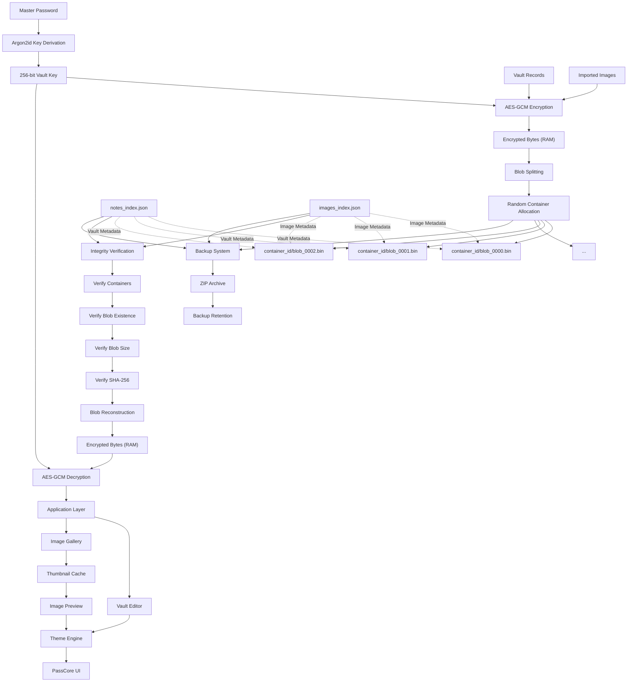

# PassCore Architecture
This Document describes the internal architecture of PassCore, including encryption, blob storage, integrity verification, image storage, backups, and the desktop application workflow.



---

# Encryption Workflow

```text
Master Password
        ↓
      Salt
        ↓
    Argon2id
        ↓
256-bit Vault Key
        ↓
     AES-GCM
        ↓
 Encrypted Vault Data
```

PassCore derives encryption keys from a user-supplied master password using Argon2id.

The derived key is used with AES-GCM authenticated encryption.

---

# Blob Storage Architecture

PassCore stores encrypted vault data inside distributed container directories.

Example:

```text
.passcore_db/

├── a76f1d9a4cd6493d/
│   └── blob_0000.bin

├── b371b06d00374fb6/
│   └── blob_0001.bin

├── e2e0f4c1dd31483c/
│   └── blob_0002.bin
```

Each blob receives:

* Container ID
* File Size
* SHA256 Hash

Metadata is recorded inside:

```text
notes_index.json
```

---

# Integrity Verification

Before vault reconstruction, PassCore validates:

* Metadata
* Containers
* Blob existence
* Blob size
* SHA256 hashes

Workflow:

```text
notes_index.json
      ↓
Verify Metadata
      ↓
Verify Container
      ↓
Verify Blob Existence
      ↓
Verify Blob Size
      ↓
Verify SHA256
      ↓
Vault Reconstruction
```

This allows PassCore to distinguish between:

```text
Wrong Password
```

and

```text
Vault Corruption
```

before decryption occurs.

---

# In-Memory Processing

PassCore processes vault data entirely in memory.

```text
Encrypted Containers
        ↓
Integrity Verification
        ↓
Blob Reconstruction
        ↓
Encrypted Bytes (RAM)
        ↓
AES-GCM Decryption
        ↓
Vault Editor
        ↓
AES-GCM Encryption
        ↓
Encrypted Bytes (RAM)
        ↓
Blob Splitting
        ↓
Encrypted Containers
```

No temporary vault files are created during normal operation.

---

# Image Vault Architecture

Imported images follow the same secure storage pipeline as the vault.

```text
    Image File
        ↓
   Read Bytes
        ↓
 AES-GCM Encryption
        ↓
Encrypted Image Bytes
        ↓
  Blob Splitting
        ↓
Random Container Allocation
        ↓
  metadata.json
        ↓
 images_index.json
```

When an image is opened:

```text
  images_index.json
        ↓
   Locate Image
        ↓
Integrity Verification
        ↓
 Blob Reconstruction
        ↓
Encrypted Image Bytes (RAM)
        ↓
 AES-GCM Decryption
        ↓
   Image Preview
```

Image data is reconstructed entirely in memory. No temporary decrypted image files are written to disk.

---

# Thumbnail Cache

To improve gallery performance, PassCore caches recently reconstructed image previews in memory.

```text
 Open Image
      ↓
 Cache Lookup
      ↓
Cache Hit ─────► Display Thumbnail
      │
      ▼
 Cache Miss
      ↓
Blob Reconstruction
      ↓
AES-GCM Decryption
      ↓
Generate Thumbnail
      ↓
Store in Cache
      ↓
Display Thumbnail
```

The cache avoids repeated blob reconstruction and decryption while browsing albums.

---

# Backup Architecture

Backups contain:

* vault.salt
* notes_index.json
* images_index.json
* settings.json
* encrypted blob containers

Workflow:

```text
Create Backup
      ↓
ZIP Archive
      ↓
Backup Retention Check
      ↓
Store Backup
```

Recovery:

```text
Restore Backup
      ↓
Extract Archive
      ↓
Restore Metadata
      ↓
Restore Containers
      ↓
Integrity Verification
      ↓
Vault Unlock
```

---

# Theme Engine

PassCore includes a runtime theme engine.

Theme settings are stored in:

```text
settings.json
```

Workflow:

```text
Select Theme
      ↓
Save Settings
      ↓
refresh_theme()
      ↓
Apply UI Styles
```

Theme changes are applied immediately without restarting the application.

---

# Storage Layout

## Linux

```text
~/.local/share/passcore/
├── vault.salt
└── notes_index.json

~/.local/share/.passcore_db/
├── container_id/
│   └── blob_*.bin
```

## Windows

```text
%APPDATA%\PassCore\
├── vault.salt
└── notes_index.json

%LOCALAPPDATA%\PassCoreData\
├── container_id\
│   └── blob_*.bin
```

---

# Packaging

## Debian

```text
/usr/bin/passcore_amd64
/usr/share/applications/passcore.desktop
/usr/share/pixmaps/passcore.png
```

## Arch Linux

```text
/usr/bin/passcore
/usr/share/applications/passcore.desktop
/usr/share/pixmaps/passcore.png
```

---

# Architecture Layers

```text
User Interface Layer
        ↓
Theme Layer
        ↓
Vault Editor Layer
        ↓
Cryptography Layer
        ↓
Storage Layer
        ↓
Integrity Layer
        ↓
Backup Layer
```

PassCore separates storage, integrity verification, encryption, backups, and user interaction into independent layers to simplify future development and maintenance.
