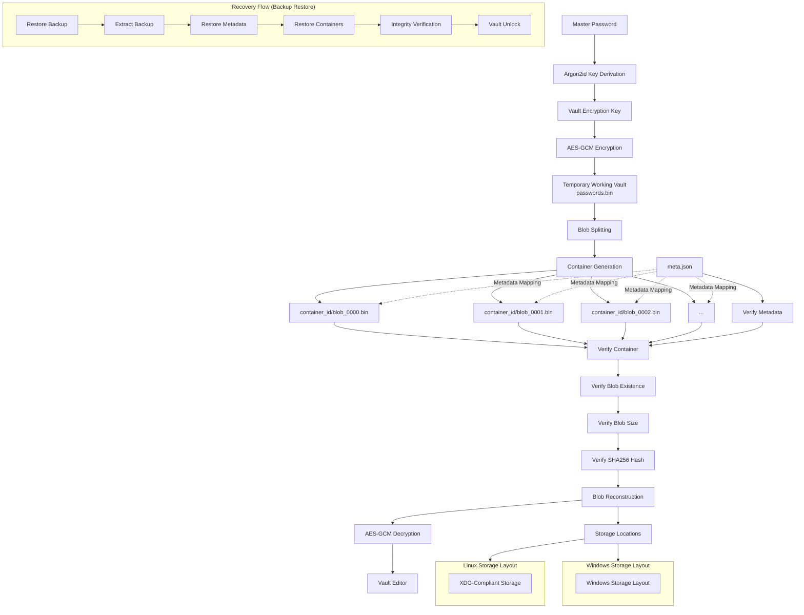

## PassCore Architecture



---

## Linux Storage Layout

```text
~/.local/share/passcore/
├── vault.salt
└── meta.json

~/.local/share/.passcore_db/
├── container_id/
│   └── blob_*.bin

~/.cache/passcore/
└── passwords.bin (temporary)
```

---

## Windows Storage Layout

```text
%APPDATA%\PassCore\
├── vault.salt
└── meta.json

%LOCALAPPDATA%\PassCoreData\
├── container_id\
│   └── blob_*.bin

%LOCALAPPDATA%\PassCore\Cache\
└── passwords.bin (temporary)
```

---

## Recovery Flow

```text
Restore Backup
      ↓
Extract Backup
      ↓
Restore Metadata
      ↓
Restore Containers
      ↓
Integrity Verification
      ↓
Vault Unlock
```