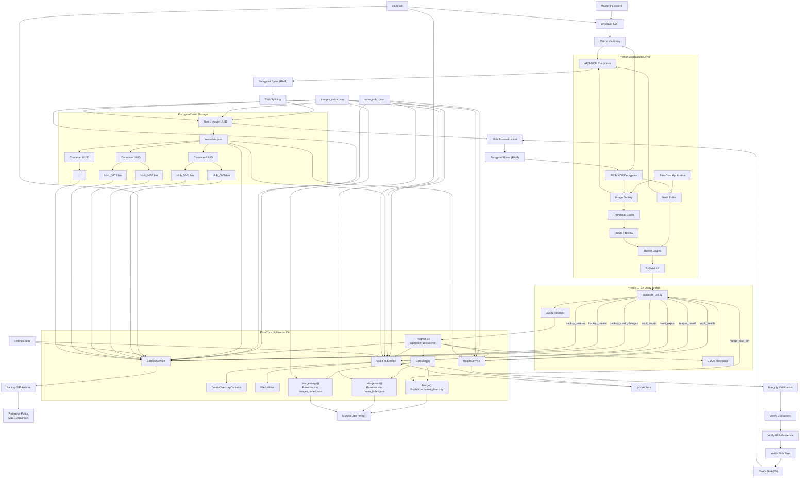

# PassCore Architecture
This Document describes the internal architecture of PassCore, including encryption, blob storage, integrity verification, image storage, backups, and the desktop application workflow.



---

# Encryption Workflow

```text
Master Password
        ↓
      Salt
        ↓
    Argon2id
        ↓
256-bit Vault Key
        ↓
     AES-GCM
        ↓
 Encrypted Vault Data
```

PassCore derives encryption keys from a user-supplied master password using Argon2id.

The derived key is used with AES-GCM authenticated encryption.

---

# Blob Storage Architecture

PassCore stores encrypted vault data inside distributed container directories.

Example:

```text
.passcore_db/

├── a76f1d9a4cd6493d/
│   └── blob_0000.bin

├── b371b06d00374fb6/
│   └── blob_0001.bin

├── e2e0f4c1dd31483c/
│   └── blob_0002.bin
```

Each blob receives:

* Container ID
* File Size
* SHA256 Hash

Metadata is recorded in two layers: a global index (`notes_index.json`) that maps note titles to note UUIDs, and a per-note `metadata.json` inside that note's own container directory, which lists every blob belonging to it.

---

# Metadata Storage Structure

PassCore separates "which note is this" from "which blobs make up this note." The global index answers the first question; the per-note `metadata.json` answers the second.

## Global Note Index — `notes_index.json`

Located at `PASSCORE_DIR/notes_index.json` (see [Storage Layout](#storage-layout)). One file for the whole vault.

```json
{
    "storage_path": "/home/user/.local/share/.passcore_db/notes",
    "notes": {
        "My Bank Login": {
            "4158797a8f3b4cef80d88e7f75325c52": {
                "created": "20-07-2026 03:05:32 PM",
                "modified": "01-09-2026 05:05:17 PM"
            }
        }
    }
}
```

* `storage_path` — absolute path to the notes container root (`CONTAINER_DIR`). `BlobMerger.MergeNote()` (C#) falls back to the OS-default `PassCorePaths.NotesContainerDirectory` if this key is absent.
* `notes` — keyed by note **title**. Each title maps to a single-entry object keyed by the note's **UUID**, holding `created` / `modified` timestamps. The UUID is also the name of the note's container directory under `storage_path`.
* Renaming a note keeps its UUID and simply moves the entry to the new title key; the UUID (and therefore its blob container) never changes.

## Per-Note Blob Metadata — `metadata.json`

Located at `<storage_path>/<note_uuid>/metadata.json`. One file per note, describing only that note's blobs.

```json
{
    "title": "My Bank Login",
    "uuid": "4158797a8f3b4cef80d88e7f75325c52",
    "created": "20-07-2026 03:05:32 PM",
    "modified": "01-09-2026 05:05:17 PM",
    "encrypted_size": 609,
    "blob_count": 10,
    "blobs": {
        "4158797a8f3b4cef80d88e7f75325c52_0000.bin": {
            "container": "667734b06edf47d2",
            "size": 64,
            "sha256": "2a70f1285e179618d3645537169bc8a473cc752a7eb58bf046a23b5ba6cc5e2"
        }
    }
}
```

* `encrypted_size` — total byte length of the encrypted note before splitting; used as a cross-check after reconstruction.
* `blob_count` — number of blob files; must equal `len(blobs)`, verified during integrity checks.
* `blobs` — keyed by **blob filename** (`<note_uuid>_NNNN.bin`, zero-padded, defining merge order). Each entry records:
  * `container` — the random per-blob container UUID the file physically lives under (`<note_uuid>/<container>/<blob_filename>`). Every blob gets its own container directory, so container IDs are not shared or sequential.
  * `size` — expected file size in bytes, checked against the file on disk.
  * `sha256` — expected hash of the blob contents, checked against the file on disk.

Reconstruction order is derived from the numeric suffix in the blob filename, not from dictionary order — both the Python `blob_integrity_verify()` path and the C# `BlobMerger` sort blobs by that suffix before concatenating them.

## Image Index — `images_index.json`

Located at `PASSCORE_DIR/images_index.json`. Mirrors the note index but nests one level deeper for albums, and stores per-image details inline (no separate per-image `metadata.json`).

```json
{
    "albums": {
        "Vacation": {
            "9f2c1a7b4e6d4a3c8b1f0d5e6a7b8c9d": {
                "beach.jpg": {
                    "uuid": "0a1b2c3d4e5f6789abcdef0123456789",
                    "mime": "image/jpeg",
                    "extension": ".jpg",
                    "width": 1920,
                    "height": 1080,
                    "size": 482301,
                    "sha256": "b1946ac92492d2347c6235b4d2611184...",
                    "created_at": "20-07-2026 03:05:32 PM"
                }
            }
        }
    }
}
```

* `albums` — keyed by **album name**, each mapping to a single-entry object keyed by an **album UUID**.
* Within an album, entries are keyed by **image filename**, each carrying its own `uuid` (used as the image's blob-container folder name), image dimensions/MIME, and an `sha256` of the *encrypted* payload (used for duplicate-import detection, not blob integrity — blob-level integrity for images uses the same container/size/sha256 pattern as notes, stored per-blob under the image's container).
* Image blobs live at `ImageContainerDirectory/<album_uuid>/<image_uuid>/...`, resolved by `BlobMerger.MergeImage(albumName, filename, outputPath)`.

---

# Integrity Verification

Before vault reconstruction, PassCore validates:

* Metadata
* Containers
* Blob existence
* Blob size
* SHA256 hashes

Workflow:

```text
notes_index.json
      ↓
Verify Metadata
      ↓
Verify Container
      ↓
Verify Blob Existence
      ↓
Verify Blob Size
      ↓
Verify SHA256
      ↓
Vault Reconstruction
```

This allows PassCore to distinguish between:

```text
Wrong Password
```

and

```text
Vault Corruption
```

before decryption occurs.

---

# In-Memory Processing

PassCore processes vault data entirely in memory.

```text
Encrypted Containers
        ↓
Integrity Verification
        ↓
Blob Reconstruction
        ↓
Encrypted Bytes (RAM)
        ↓
AES-GCM Decryption
        ↓
Vault Editor
        ↓
AES-GCM Encryption
        ↓
Encrypted Bytes (RAM)
        ↓
Blob Splitting
        ↓
Encrypted Containers
```

No temporary vault files are created during normal operation.

---

# Image Vault Architecture

Imported images follow the same secure storage pipeline as the vault.

```text
    Image File
        ↓
   Read Bytes
        ↓
 AES-GCM Encryption
        ↓
Encrypted Image Bytes
        ↓
  Blob Splitting
        ↓
Random Container Allocation
        ↓
  metadata.json
        ↓
 images_index.json
```

When an image is opened:

```text
  images_index.json
        ↓
   Locate Image
        ↓
Integrity Verification
        ↓
 Blob Reconstruction
        ↓
Encrypted Image Bytes (RAM)
        ↓
 AES-GCM Decryption
        ↓
   Image Preview
```

Image data is reconstructed entirely in memory. No temporary decrypted image files are written to disk.

---

# Thumbnail Cache

To improve gallery performance, PassCore caches recently reconstructed image previews in memory.

```text
 Open Image
      ↓
 Cache Lookup
      ↓
Cache Hit ─────► Display Thumbnail
      │
      ▼
 Cache Miss
      ↓
Blob Reconstruction
      ↓
AES-GCM Decryption
      ↓
Generate Thumbnail
      ↓
Store in Cache
      ↓
Display Thumbnail
```

The cache avoids repeated blob reconstruction and decryption while browsing albums.

---

# PCV Export / Import

The `.pcv` format is a **full-vault** archive produced by the C# Utility Bridge (`VaultFileService`), covering `vault.salt`, `notes_index.json`, `images_index.json`, `settings.yaml`, and every encrypted blob container — the same contents as a backup. It is intended for moving or restoring an entire vault wholesale.

This is distinct from the **`.pcx` PassCore Package** format used by the File → Import / Export dialog (see [MENUSYSTEM.md](MENUSYSTEM.md#file-menu)), which is built and encrypted entirely in the Python layer (Argon2id + AES-GCM, no C# bridge involved) and carries a hand-picked subset of credentials or image albums rather than the whole vault.

---

# Blob Merge Operations

Blob reconstruction (concatenating a note's or image's `_NNNN.bin` chunks back into one encrypted binary) is performed by `BlobMerger` in the C# utility, not in Python. It is reached over the same JSON-over-stdio bridge as backups and PCV, via three dispatcher operations:

| Operation | C# entry point | Resolution | Python wrapper |
|---|---|---|---|
| `merge_blob_bin` | `BlobMerger.Merge(containerDirectory, outputPath)` | Caller supplies the note/image container directory directly | `PassCoreUtility.merge_blob_bin()` — used today by `enc.py`'s `merge_blob_bin()` |
| `merge_note_blob` | `BlobMerger.MergeNote(title, outputPath)` | C# looks up the title in `notes_index.json` to find the note UUID, then merges `<storage_path>/<uuid>` | not yet exposed in `passcore_util.py` |
| `merge_image_blob` | `BlobMerger.MergeImage(albumName, filename, outputPath)` | C# looks up the album and filename in `images_index.json` to find the image UUID, then merges `ImageContainerDirectory/<album_uuid>/<image_uuid>` | not yet exposed in `passcore_util.py` |

All three converge on the same `MergeCore()` routine: it reads that container's `metadata.json`, orders blobs by the numeric suffix in their filename, streams each blob from `<container>/<blob_container_id>/<blob_filename>` into the output file, and verifies the merged result's size against both the sum of blobs written and the `encrypted_size` recorded in `metadata.json`.

`merge_note_blob` and `merge_image_blob` let the C# side resolve a note or image straight from title/filename without Python first walking `notes_index.json` / `images_index.json` itself — today only `merge_blob_bin` is wired up on the Python side, with `enc.py` and `images.py` doing that index lookup themselves before calling it.

---

# Backup Architecture

Backups contain:

* vault.salt
* notes_index.json
* images_index.json
* settings.yaml
* encrypted blob containers

Workflow:

```text
Create Backup
      ↓
ZIP Archive
      ↓
Backup Retention Check
      ↓
Store Backup
```

Recovery:

```text
Restore Backup
      ↓
Extract Archive
      ↓
Restore Metadata
      ↓
Restore Containers
      ↓
Integrity Verification
      ↓
Vault Unlock
```

---

# Theme Engine

PassCore includes a runtime theme engine.

Theme settings are stored in:

```text
settings.yaml
```

Workflow:

```text
Select Theme
      ↓
Save Settings
      ↓
refresh_theme()
      ↓
Apply UI Styles
```

Theme changes are applied immediately without restarting the application.

---

# Storage Layout

## Linux

```text
~/.local/share/passcore/
├── vault.salt
├── notes_index.json
└── images_index.json

~/.local/share/.passcore_db/notes/
├── <note_uuid>/
│   ├── metadata.json
│   └── <blob_container_id>/
│       └── <note_uuid>_NNNN.bin

~/.local/share/.passcore_db/images/     (ImageContainerDirectory)
├── <album_uuid>/
│   └── <image_uuid>/
│       ├── metadata.json
│       └── <blob_container_id>/
│           └── <image_uuid>_NNNN.bin
```

## Windows

```text
%APPDATA%\PassCore\
├── vault.salt
├── notes_index.json
└── images_index.json

%LOCALAPPDATA%\PassCoreData\notes\
├── <note_uuid>\
│   ├── metadata.json
│   └── <blob_container_id>\
│       └── <note_uuid>_NNNN.bin

%LOCALAPPDATA%\PassCoreData\images\     (ImageContainerDirectory)
├── <album_uuid>\
│   └── <image_uuid>\
│       ├── metadata.json
│       └── <blob_container_id>\
│           └── <image_uuid>_NNNN.bin
```

Each note or image gets its own `metadata.json` inside its UUID-named directory (see [Metadata Storage Structure](#metadata-storage-structure)); `notes_index.json` and `images_index.json` are the only global indexes, and neither embeds blob-level detail — that stays local to each container.

---

# Packaging

## Debian

```text
/usr/bin/passcore_amd64
/usr/share/applications/passcore.desktop
/usr/share/pixmaps/passcore.png
```

## Arch Linux

```text
/usr/bin/passcore
/usr/share/applications/passcore.desktop
/usr/share/pixmaps/passcore.png
```

---

# Architecture Layers

```text
User Interface Layer
        ↓
    Theme Layer
        ↓
Vault Editor / Gallery Layer
        ↓
 Cryptography Layer
        ↓
Storage & Metadata Layer
        ↓
Integrity & Health Layer
        ↓
Python ↔ C# Utility Bridge
        ↓
C# Utility Layer
        ├── Backup / Restore
        ├── PCV Import / Export
        └── Vault Health
```

PassCore separates storage, integrity verification, encryption, backups, and user interaction into independent layers to simplify future development and maintenance.