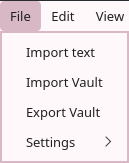
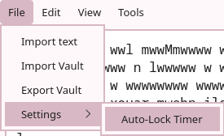
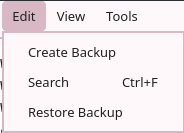
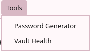
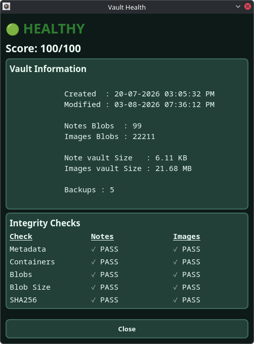

# PassCore Menu System

## Overview

PassCore provides a desktop interface built with PySide6 that integrates vault management, backup operations, diagnostics, password generation, search, and configuration tools.

---

# File Menu


## Import Text File

Allows importing plaintext credentials directly into the vault editor.

Workflow:
```text
Import TXT
    ↓
Replace Existing Records
    OR
Append Records
    ↓
Vault Editor
```
---

## Import PassCore Vault (.pcv)

Imports an encrypted PassCore vault archive.

Workflow:
```text
Select Vault
      ↓
Extract Archive
      ↓
Restore Metadata
      ↓
Restore Containers
      ↓
Lock Imported Vault
      ↓
Unlock Imported Vault
```
---

## Export PassCore Vault (.pcv)

Creates a portable encrypted vault archive.

Exported Contents:

* vault.salt
* meta.json
* encrypted containers

---

## Settings

### Auto-Lock Timer

Configure automatic vault locking after inactivity.

Range:

* 1 minute
* 5 minutes
* 10 minutes
* 30 minutes
* 60 minutes

---

# Edit Menu

## Search Records

Search records stored inside the vault editor.

Features:

* Ctrl + F shortcut
* Case-insensitive matching
* Match counter
* Previous/Next navigation
* Editor focus tracking

Workflow:
```text
Enter Search Term
        ↓
Locate Matches
        ↓
Navigate Results
```
---

# Tools Menu

## Password Generator

Generate cryptographically secure passwords.

Access:
```text
Tools
└── Password Generator
```
---

## Vault Health Diagnostics

PassCore includes an integrated Vault Health Diagnostics system that provides visibility into vault integrity, storage status, and backup availability.



The diagnostics dashboard reports:

* Vault health score
* Metadata validation status
* Container verification status
* Blob existence verification
* Blob size verification
* SHA256 integrity verification
* Backup availability
* Vault statistics and storage information

Access:

```text
Tools
└── Vault Health
```
---

# Vault Operations

## Unlock Vault
```text
Master Password
      ↓
Argon2id
      ↓
Integrity Verification
      ↓
Vault Reconstruction
      ↓
Editor Access
```
---

## Lock Vault
```text
User Lock Request
      ↓
Editor Hidden
      ↓
Key Removed From Memory
      ↓
Vault Locked
```
---

## Auto-Lock
```text
User Inactive
      ↓
Timer Expired
      ↓
Vault Locked
```
---

## Autosave
```text
Editor Modified
      ↓
60 Second Delay
      ↓
Automatic Save
      ↓
Backup Creation
```
---

# Current Interface Features

* Vault Lock / Unlock
* Auto-Lock Timer
* Autosave
* Save Tracking
* Vault Size Tracking
* Vault Status Monitoring
* Search Records
* Password Generator
* Vault Health Diagnostics
* Backup Management
* Import TXT
* Import PCV
* Export PCV
* Settings System