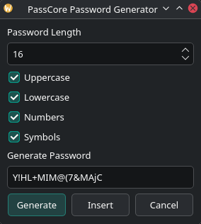
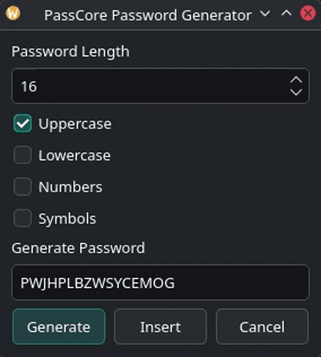
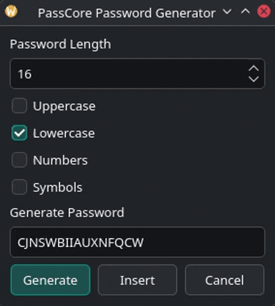
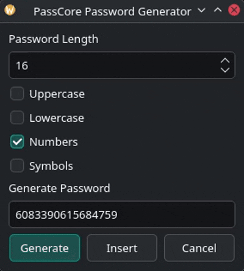
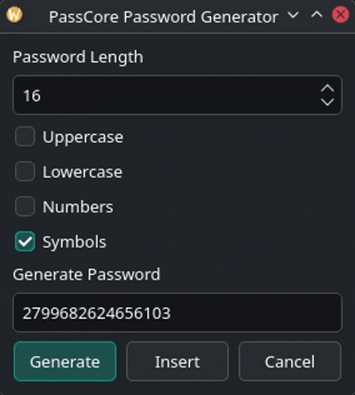
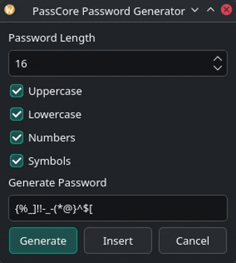

# PassCore Password Generator

## Overview

PassCore includes a built-in password generator designed to help users create strong, unique passwords directly within the application.

The generator uses Python's `secrets` module to provide cryptographically secure randomness suitable for password generation and credential management.

Generated passwords can be inserted directly into the vault editor for immediate storage.

---

## Features

* Cryptographically secure password generation
* Configurable password length
* Uppercase character support (`A-Z`)
* Lowercase character support (`a-z`)
* Numeric character support (`0-9`)
* Symbol character support (`!@#$%^&*()-_=+[]{}`)
* Direct insertion into the vault editor
* Integrated into the PassCore Tools menu

---

## Accessing the Generator

Open the generator from the menu bar:

```text
Tools
└── Password Generator
```

---

## User Interface

```text
Password Generator

Length
[ 16 ]

☑ Uppercase
☑ Lowercase
☑ Numbers
☑ Symbols

Generated Password

[V7#pQ9@kR2!mT5x]

[ Generate ]
[ Insert ]
[ Cancel ]
```

---

## Configuration Options

### Password Length

Users may specify the desired password length.



---

## Character Sets

The following character groups can be enabled or disabled:

### Uppercase



### Lowercase



### Numbers



### Symbols



At least one character group must remain enabled.

---

## Password Generation Process

PassCore generates passwords using Python's secure random number generator.

Workflow:

```text
User Selection
       ↓
Character Set Construction
       ↓
Cryptographically Secure Random Selection
       ↓
Password Generation
       ↓
Display Password
       ↓
Optional Vault Insertion
```

---

## Security Considerations

PassCore uses:

```python
import secrets
```

instead of:

```python
import random
```

The `secrets` module is specifically designed for generating cryptographic tokens and passwords and is recommended for security-sensitive applications.

Generated passwords are not transmitted over the network and remain entirely local to the user's device.

---

## Example Passwords


---

## Design Goals

The Password Generator complements PassCore's secure storage architecture by enabling users to create strong credentials before storing them inside the encrypted vault.

Workflow:

```text
Generate Password
        ↓
Store in Vault
        ↓
Encrypt Vault
        ↓
Protect Credentials
```
---
# Future Enhancements

Planned improvements include:

* Password strength estimation
* One-click clipboard copy
* Passphrase generation
* Exclusion of ambiguous characters (`O`, `0`, `I`, `l`)
* Custom symbol selection
* Password history generation
---

This allows PassCore to provide both credential generation and credential protection within a single application.
