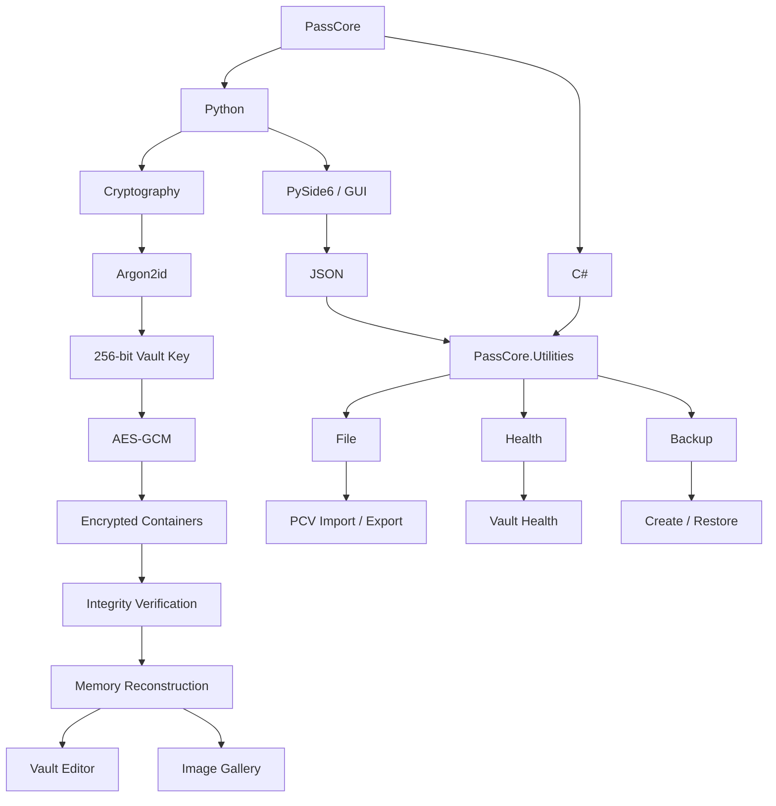

# PassCore

<p align="center">
  
</p>

<p align="center">
  Offline-First • Distributed Blob Storage • Integrity Verification • Secure Vault Management
</p>

PassCore is an offline-first desktop password manager designed to keep your data private and under your control.

Unlike cloud-based password managers, PassCore stores everything locally on your device. Your vault never leaves your computer, and no online account is required.

Built with Python and PySide6, PassCore combines modern encryption, distributed blob storage, automatic integrity verification, encrypted image storage, backups, and a clean desktop interface into a single secure application.

> **Project Status:** Alpha (v0.5.0)

---

## Why PassCore?

Most password managers rely on cloud synchronization and online accounts.

PassCore follows a different philosophy:

- Everything stays on your device.
- No cloud storage.
- No user accounts.
- No tracking.
- No subscriptions.
- No internet connection required.

Your data belongs to you.

---

## Features

### Security
- AES-GCM authenticated encryption
- Argon2id key derivation
- Master password authentication
- Automatic vault locking
- Memory-only vault reconstruction
- SHA-256 integrity verification
- Blob corruption detection
- Automatic vault backups & recovery

### Password Vault
- Secure password storage
- Integrated password generator
- Record search (Ctrl+F) with match navigation
- Autosave & save-before-close protection
- Vault statistics, created & modified timestamps

### Image Vault
- Import images into encrypted storage
- Album management with a responsive, Google Photos–style gallery
- Thumbnail caching & image preview
- Rename, delete, and multi-select support
- Encrypted blob storage with integrity verification

### User Interface
- Runtime theme switching — 13 built-in light & dark themes
- Welcome screen, custom password dialogs
- Cross-platform desktop application

---



*Full architecture, storage layout, and integrity workflows: see [ARCHITECTURE.md](ARCHITECTURE.md).*

---


---

## How It Works

```text
Master Password
        ↓
     Argon2id
        ↓
256-bit Vault Key
        ↓
     AES-GCM
        ↓
Encrypted, Blob-Split Storage
        ↓
SHA-256 Integrity Verification
        ↓
   Vault Editor / Image Gallery
```

Vault data is reconstructed entirely in memory — no temporary vault or image files are written to disk. Integrity is checked *before* decryption, so PassCore can tell a wrong password apart from a corrupted vault.

---

## Utility Bridge (.NET)

Vault health diagnostics, backups, and `.pcv` export/import run in a compiled .NET process that the PySide6 app talks to over a JSON-over-stdio bridge (`passcore_util.py`).

The utility isn't committed to the repo and must be built once:

```bash
cd utilities/PassCore.Utilities
dotnet build
```

Rebuild any time a `.cs` file under `utilities/` changes.

---

## Platform Support

| Platform | Status |
|----------|--------|
| Arch Linux | ✅ Tested |
| Ubuntu | ✅ Tested |
| Windows 10 | ✅ Tested |
| Windows 11 | ✅ Tested |

## Requirements

* Python 3.10+
* cryptography
* argon2-cffi
* PySide6
* .NET SDK 10.0 — to build the vault utility bridge (see above)

---

## Developer Documentation

- [ARCHITECTURE.md](ARCHITECTURE.md) — Storage architecture, blob distribution, integrity verification, recovery workflows, and platform layouts.
- [MENUSYSTEM.md](MENUSYSTEM.md) — Menu hierarchy, vault operations, diagnostics dashboard, search system, import/export workflows, settings, and UI features.
- [PASSWORDGEN.md](PASSWORDGEN.md) — Password generator design, configuration options, and generation workflow.

---

## Installation (for testing via repo)

### Packages

**Debian**
```bash
sudo dpkg -i passcore_0.4.1_amd64.deb
```

**Arch Linux**
```bash
sudo pacman -U passcore_0.4.1_x86_64.pkg.tar.zst
```

### Git Repo

**Linux**
```bash
git clone https://github.com/Money-Ape/PassCore.git
cd PassCore

# Build the .NET vault utility (see Utility Bridge above)
cd utilities/PassCore.Utilities
dotnet build
cd ../..

chmod +x run.sh
./run.sh
```

**Windows**
```text
git clone https://github.com/Money-Ape/PassCore.git
cd PassCore

cd utilities\PassCore.Utilities
dotnet build
cd ..\..

Double-click windows.bat
```

Both launchers create a virtual environment (if missing), install dependencies, and start PassCore. The `dotnet build` step is currently manual and not yet run automatically by `run.sh` or `windows.bat`.

---

## Planned Features

- Video Vault
- Document Vault
- Drag & Drop image import
- Clipboard image paste
- Image export
- Incremental note saving
- Parallel blob encryption
- Storage compaction & compression improvements
- Secure deletion improvements
- Full vault diagnostics

---

## Disclaimer

PassCore is an educational and experimental project.

It has not undergone a professional security audit and should not yet be considered production-ready for storing highly sensitive information.

While PassCore implements modern cryptographic primitives such as Argon2id and AES-GCM, users should review the source code carefully before relying on it for critical data protection.

---

## License

This project is currently released for educational and research purposes. Future licensing terms may evolve as the project matures.