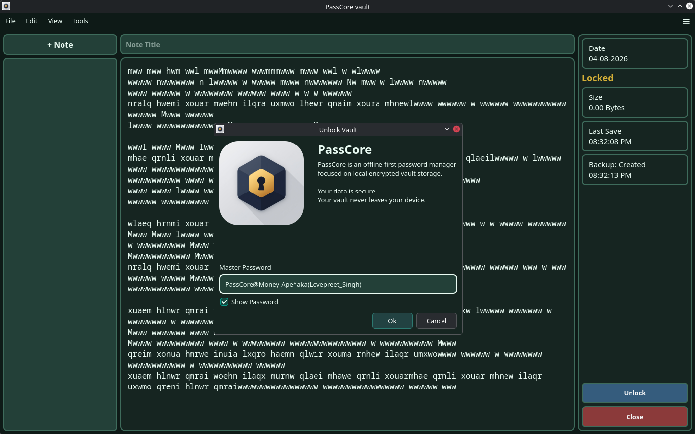
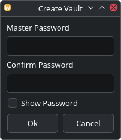

# PassCore

<p align="center">
  
</p>

<p align="center">
  Offline-First • Distributed Blob Storage • Integrity Verification • Secure Vault Management
</p>

PassCore is an offline-first desktop password manager designed to keep your data private and under your control.

Unlike cloud-based password managers, PassCore stores everything locally on your device. Your vault never leaves your computer, and no online account is required.

Built with Python and PySide6, PassCore combines modern encryption, distributed blob storage, automatic integrity verification, encrypted image storage, backups, and a clean desktop interface into a single secure application.

> **Project Status:** Alpha (v0.5.0)

---

## Why PassCore?

Most password managers rely on cloud synchronization and online accounts.

PassCore follows a different philosophy:

- Everything stays on your device.
- No cloud storage.
- No user accounts.
- No tracking.
- No subscriptions.
- No internet connection required.

Your data belongs to you.

---

## Features
### Security
- AES-GCM authenticated encryption
- Argon2id key derivation
- Master password authentication
- Automatic vault locking
- Memory-only vault reconstruction
- SHA-256 integrity verification
- Blob corruption detection
- Automatic vault backups & recovery

### Password Vault
- Secure password storage
- Integrated password generator
- Record search (Ctrl+F)
- Match navigation
- Autosave
- Save-before-close protection
- Vault statistics
- Created & modified timestamps

### Image Vault
- Import images into encrypted storage
- Album management
- Responsive gallery layout
- Google Photos–style timeline
- Thumbnail caching
- Image preview
- Image rename
- Image deletion
- Multi-image selection
- Context menu support
- Vault image integrity verification
- Encrypted blob storage

### User Interface
- Runtime theme switching
- 13 built-in themes
- Light & dark themes
- Welcome screen
- Custom password dialogs
- Cross-platform desktop application

---


---


## Vault Unlock Flow

```text
Encrypted Containers
        ↓
notes_index.json Verification
        ↓
 Verify Container
        ↓
Verify Blob Existence
        ↓
 Verify Blob Size
        ↓
  Verify SHA256
        ↓
Blob Reconstruction
        ↓
Encrypted Vault Data (Memory)
        ↓
AES-GCM Decryption
        ↓
   Vault Editor
```

PassCore reconstructs encrypted vault data directly in memory during unlock operations and does not create temporary vault files on disk.

---

## Password Authentication Workflow

PassCore uses a custom password dialog for vault creation and vault unlocking.



### First Run

```text
Create Vault
      ↓
Enter Master Password
      ↓
Confirm Password
      ↓
Password Validation
      ↓
Argon2id Key Derivation
      ↓
Vault Creation
```

### Vault Unlock

```text
Unlock Vault
      ↓
Enter Master Password
      ↓
Optional Password Visibility Toggle
      ↓
Argon2id Key Derivation
      ↓
AES-GCM Authentication
      ↓
Vault Editor
```

The password confirmation workflow helps prevent accidental vault creation with mistyped master passwords.

The password visibility toggle allows users to verify their password input before authentication.

## Password Generator

PassCore includes an integrated password generator capable of creating cryptographically secure passwords using Python's `secrets` module.

The generator supports:

* Configurable password length
* Uppercase characters
* Lowercase characters
* Numeric characters
* Symbol characters
* Direct insertion into the vault editor

Access:
```text
Tools
└── Password Generator
```
---

## Image Vault
PassCore includes an encrypted image vault designed for storing personal images alongside your passwords.

Features include:

- Album management
- Import multiple images
- Google Photos–style gallery
- Timeline grouping
- Responsive layout
- Thumbnail cache
- Multi-image selection
- Rename & delete support
- Blob integrity verification
- AES-GCM encrypted storage

Images are stored as encrypted blobs and reconstructed entirely in memory when viewed.

---

## Search Records

PassCore includes an integrated vault search system for quickly locating records inside the editor.

The search system supports:

* Ctrl+F search shortcut
* Sidebar-integrated search interface
* Theme-aware search highlighting
* Live match counter
* Previous / Next navigation
* Match highlighting
* Previous/Next match navigation
* Match counter display

Access:

```text
Edit
└── Search
```

---

## Theme System

PassCore includes a runtime theme engine with live theme switching.

Available themes:

* Slate Grey
* Pale Green
* Beige
* Mint Green
* Sage Green
* Light Blue
* Blue Grey
* Ivory
* Cream Dark Grey
* Sage Dark Grey
* Blue Grey Black
* Charcoal
* Default

Themes can be changed from:

```text
Settings
└── Themes
```

---

### Health Verification Workflow
```text
Read Metadata
      ↓
Verify Containers
      ↓
Verify Blobs
      ↓
Verify Blob Sizes
      ↓
Verify SHA256
      ↓
Check Backups
      ↓
Generate Health Report
```

---

# Security Design
## Key Derivation

PassCore derives vault encryption keys from a master password using Argon2id.

```text
 Master Password
        ↓
      Salt
        ↓
    Argon2id
        ↓
256-bit Vault Key
        ↓
     AES-GCM
```

---

## Storage Layout

PassCore separates vault metadata from encrypted storage.

### Linux (XDG Compliant)

```text
~/.local/share/passcore/
├── vault.salt
├── notes_index.json
├── settings.yaml
└── images_index.json

~/.local/share/.passcore_db/
├── note_uuid/
│   ├── metadata.json
│   ├── container_uuid/
│   │   └── blob_0000.bin
│   ├── container_uuid/
│   │   └── blob_0001.bin
│   └── container_uuid/
│       └── blob_XXXX.bin
```

### Windows

```text
%APPDATA%\PassCore\
├── vault.salt
├── notes_index.json
├── settings.yaml
└── images_index.json

%LOCALAPPDATA%\PassCoreData\
├── note_uuid/
│   ├── metadata.json
│   ├── container_uuid/
│   │   └── blob_0000.bin
│   ├── container_uuid/
│   │   └── blob_0001.bin
│   └── container_uuid/
│       └── blob_XXXX.bin
```

Each note owns its own storage directory.
During every save, encrypted blobs are regenerated and metadata is updated while note identity remains tied to its UUID rather than its title.

---

## Note Storage

Every note is identified by a randomly generated UUID.

The displayed title is only a user-facing label and may be renamed at any time without affecting the underlying encrypted storage.

Each note stores:

```text
metadata.json
↓
Container UUIDs
↓
Encrypted Blobs
↓
SHA-256 Integrity Information
```

This separation allows PassCore to rename notes without relocating encrypted data on disk.

---

## Distributed Blob Storage

Each note is assigned a permanent UUID.

Inside each note directory, encrypted vault data is divided into fixed-size encrypted blobs distributed across randomly generated container directories.

```text
.passcore_db/

note_uuid/
├── metadata.json
├── 7f61d7ab3f654d91/
│   ├── blob_0001.bin
├── c23f0a2b78484d66/
│   ├── blob_0002.bin
└── ...
```

Every blob records:

- Container identifier
- Blob size
- SHA-256 checksum

These values are used during vault reconstruction and integrity verification before decryption.

Container identifiers are recorded inside metadata and used during integrity verification and vault reconstruction.

Example metadata entry:

```json
{
    "blob_0000.bin": {
        "container": "a76f1d9a4cd6493d",
        "size": 32,
        "sha256": "..."
    }
}
```

This architecture separates:

```text
  Storage Layer
        ↓
 Metadata Layer
        ↓
 Integrity Layer
        ↓
  Recovery Layer
```

and provides a foundation for future distributed storage strategies.

---

## Image Storage
Images are encrypted before being written to disk.

Each imported image is:
```text
     Image
       ↓
AES-GCM Encryption
       ↓
   Blob Split
       ↓
Random Containers
       ↓
Metadata Generation
       ↓
Integrity Verification
```
Images are reconstructed only when opened inside the gallery.

---

## Blob Integrity Verification

Before vault reconstruction, PassCore validates stored blobs using metadata recorded in `notes_index.json`.

Verification includes:

* Container verification
* Blob existence verification
* Blob size verification
* SHA256 hash verification

Verification flow:

```text
    notes_index.json
        ↓
 Verify Container
        ↓
Verify Blob Existence
        ↓
  Verify Blob Size
        ↓
  Verify SHA256
        ↓
Blob Reconstruction
        ↓
Vault Decryption
```

This allows PassCore to distinguish between:

```text
Wrong Master Password
```

and

```text
Vault Corruption
```

before attempting decryption.

---

## Backup and Recovery

PassCore automatically creates compressed ZIP backups of vault storage data.

Backups contain:

* vault.salt
* notes_index.json
* settings.yaml
* images_index.json
* All encrypted note directories
* Image vault storage

Backups are stored separately from vault storage.

### Linux

```text
~/.local/share/passcore_backups/
```

### Windows

```text
LOCALAPPDATA\PassCore Backups\
```

### Backup Workflow

```text
  Create Backup
        ↓
   ZIP Archive
        ↓
Backup Retention Check
        ↓
Keep Latest N Backups
```

### Recovery Workflow

```text
  Restore Backup
        ↓
 Extract Containers
        ↓
 Restore Metadata
        ↓
Integrity Verification
        ↓
   Vault Unlock
```

PassCore can recover from:

* Missing blobs
* Missing containers
* Corrupted blobs
* Accidental vault deletion
* Failed vault modifications

Backup retention automatically removes older backups after the configured limit is reached.

---

## Utility Bridge (.NET)

Vault health diagnostics, backup creation/restoration, and vault export/import (`.pcv`) are implemented in C# (.NET) rather than pure Python. The PySide6 application talks to a compiled .NET process through a lightweight JSON-over-stdio bridge (`passcore_util.py`).

```text
PySide6 Application
        ↓
passcore_util.py (subprocess bridge)
        ↓
   JSON over stdin/stdout
        ↓
PassCore.Utilities (.NET process)
        ↓
HealthService / BackupService / VaultFileService
```

The utility must be built before these features will work — it is not committed to the repository:

```bash
cd utilities/PassCore.Utilities
dotnet build
```

This produces `bin/Debug/net10.0/PassCore.Utilities` (`PassCore.Utilities.exe` on Windows), which `passcore_util.py` locates automatically. Rebuild any time a `.cs` file under `utilities/` changes.

---

## Current Capabilities

### Vault Operations

* Vault creation
* Vault initialization metadata
* Master password authentication
* Vault locking/autolocking after inactivity and unlocking
* Save-before-close workflow & Automatic vault autosave
* Password confirmation workflow & visibility toggle
* Integrated password generator
* Integrated record search and navigation
* Background backup creation
* Background backup restoration

### Cryptography

* Argon2id key derivation
* AES-GCM authenticated encryption
* Wrong-password detection

### Storage System

* Blob generation
* Blob reconstruction
* UUID-based note storage
* Distributed blob container storage
* Per-note metadata
* Per-blob SHA-256 verification
* Metadata-driven reconstruction
* In-memory vault reconstruction
* In-memory vault encryption/decryption workflow
* Automatic backup creation
* Backup recovery
* Backup retention management
* XDG-compliant storage layout
* Cross-platform path abstraction

### Integrity Verification

* Corruption detection
* Container verification
* Blob existence verification
* Blob size verification
* SHA256 blob integrity verification

### Image Vault

* Image import
* Album management
* Google Photos–style timeline
* Responsive gallery
* Image cache
* Multi-image selection
* Context menu
* Rename images
* Delete images
* Blob reconstruction
* Image integrity verification

### User Interface

* PySide6 desktop application
* Custom password dialogs with validation and visibility controls
* Vault status, integrity, size, and timestamp monitoring
* Autosave, save tracking, lock screen, and inactivity-based auto-lock
* Backup management and recovery integration
* Password Generator and Vault Health Diagnostics dashboards
* Health scoring, integrity verification, and backup reporting
* Backend-integrated vault editing workflow
* Record search dashboard with match navigation
* Theme management dialog
* Placeholder-style welcome screen

---

## Planned Features
- Video Vault
- Document Vault
- Drag & Drop image import
- Clipboard image paste
- Image export
- Incremental note saving
- Parallel blob encryption
- Storage compaction
- Vault compression improvements
- Secure deletion improvements
- Full vault diagnostics

---

## Platform Support
| Platform | Status |
|----------|--------|
| Arch Linux | ✅ Tested |
| Ubuntu | ✅ Tested |
| Windows 10 | ✅ Tested |
| Windows 11 | ✅ Tested |

---

## Requirements

* Python 3.10+
* cryptography
* argon2-cffi
* PySide6
* .NET SDK 10.0 — required to build the vault utility bridge (see [Utility Bridge](#utility-bridge-net) below)

---

## Developer Documentation

- [ARCHITECTURE.md](ARCHITECTURE.md) — Storage architecture, blob distribution, integrity verification, recovery workflows, and platform layouts.
- [PASSWORDGEN.md](PASSWORDGEN.md) — Password Generator architecture, configuration options, generation workflow, and security design.
- [MENUSYSTEM.md](MENUSYSTEM.md) — Menu hierarchy, vault operations, diagnostics dashboard, search system, import/export workflows, settings, and user interface features.

---

## Installation (for testing via repo)

## Packages
### Debian
```bash
sudo dpkg -i passcore_0.4.1_amd64.deb
```

## Arch Linux
```bash
sudo pacman -U passcore_0.4.1_x86_64.pkg.tar.zst
```

## Git Repo :
### Linux

```bash
git clone https://github.com/Money-Ape/PassCore.git
cd PassCore

# Build the .NET vault utility (required for backups, restore,
# health diagnostics, and vault export/import — see Utility Bridge above)
cd utilities/PassCore.Utilities
dotnet build
cd ../..

chmod +x run.sh
./run.sh
```

### Windows

```text
git clone https://github.com/Money-Ape/PassCore.git
cd PassCore

cd utilities\PassCore.Utilities
dotnet build
cd ..\..

Double-click windows.bat
```

The Windows launcher automatically:

* Creates a virtual environment (if missing)
* Installs required dependencies
* Launches PassCore

The Linux launcher performs equivalent dependency checks and initialization.

The `dotnet build` step above builds the .NET vault utility bridge (see [Utility Bridge](#utility-bridge-net)) and is currently a manual, one-time step — it is not yet handled automatically by `run.sh` or `windows.bat`.

---

## Disclaimer

PassCore is an educational and experimental project.

It has not undergone a professional security audit and should not yet be considered production-ready for storing highly sensitive information.

While PassCore implements modern cryptographic primitives such as Argon2id and AES-GCM, users should review the source code carefully before relying on it for critical data protection.

---

## License

This project is currently released for educational and research purposes. Future licensing terms may evolve as the project matures.