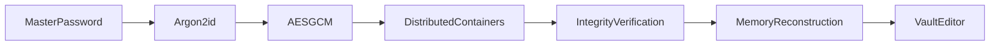

# PassCore


A cryptographic password manager written in Python, focused on secure vault storage, authenticated encryption, and master-password-based access control.

> **Project Status:** Alpha Pre-release (v0.3.5-alpha)

---

## Features

* AES-GCM encryption with Argon2id key derivation
* Master-password protected vault with custom authentication dialog
* Password confirmation, validation, and visibility toggle support
* Binary vault storage with distributed blob container architecture
* Metadata-driven reconstruction and SHA256 integrity verification
* Vault corruption detection and recovery validation
* Automatic backups, recovery workflows, and backup retention
* Vault locking, unlocking, autosave, inactivity-based auto-lock, and save-before-exit protection
* Vault size tracking and created/modified timestamps
* Cross-platform storage layouts (Linux & Windows)
* Built-in cryptographically secure password generator
* Memory-only vault reconstruction and editing workflow
* Integrated vault health diagnostics and integrity reporting
* Integrated record search with match navigation and Ctrl+F support
* Built-in cryptographically secure password generator
* Import TXT records and import/export PassCore Vaults (.pcv)
* Vault size tracking, timestamps, and cross-platform storage layouts
* PySide6 desktop interface with integrated backup and management tools
---


---

## Vault Unlock Flow

```text
Encrypted Containers
        ↓
meta.json Verification
        ↓
 Verify Container
        ↓
Verify Blob Existence
        ↓
 Verify Blob Size
        ↓
  Verify SHA256
        ↓
Blob Reconstruction
        ↓
Encrypted Vault Data (Memory)
        ↓
AES-GCM Decryption
        ↓
   Vault Editor
```

PassCore reconstructs encrypted vault data directly in memory during unlock operations and does not create temporary vault files on disk.
---

## Password Authentication Workflow

PassCore uses a custom password dialog for vault creation and vault unlocking.


### First Run

```text
Create Vault
      ↓
Enter Master Password
      ↓
Confirm Password
      ↓
Password Validation
      ↓
Argon2id Key Derivation
      ↓
Vault Creation
```

### Vault Unlock

```text
Unlock Vault
      ↓
Enter Master Password
      ↓
Optional Password Visibility Toggle
      ↓
Argon2id Key Derivation
      ↓
AES-GCM Authentication
      ↓
Vault Editor
```

The password confirmation workflow helps prevent accidental vault creation with mistyped master passwords.

The password visibility toggle allows users to verify their password input before authentication.

## Password Generator

PassCore includes an integrated password generator capable of creating cryptographically secure passwords using Python's `secrets` module.

The generator supports:

* Configurable password length
* Uppercase characters
* Lowercase characters
* Numeric characters
* Symbol characters
* Direct insertion into the vault editor

Access:
```text
Tools
└── Password Generator
```
---

## Search Records

PassCore includes an integrated vault search system for quickly locating records inside the editor.

The search system supports:

* Ctrl+F search shortcut
* Sidebar-integrated search interface
* Case-insensitive searching
* Match highlighting
* Previous/Next match navigation
* Match counter display

Access:

```text
Edit
└── Search
```
---

### Health Verification Workflow
```text
Read Metadata
      ↓
Verify Containers
      ↓
Verify Blobs
      ↓
Verify Blob Sizes
      ↓
Verify SHA256
      ↓
Check Backups
      ↓
Generate Health Report
```
---

# Security Design
## Key Derivation

PassCore derives vault encryption keys from a master password using Argon2id.

```text
 Master Password
        ↓
      Salt
        ↓
    Argon2id
        ↓
256-bit Vault Key
        ↓
     AES-GCM
```

---

## Storage Layout

PassCore uses platform-appropriate storage locations.

### Linux (XDG Compliant)

```text
~/.local/share/passcore/
├── vault.salt
└── meta.json

~/.local/share/.passcore_db/
├── container_id/
│   └── blob_*.bin
```

### Windows

```text
%APPDATA%\PassCore\
├── vault.salt
└── meta.json

%LOCALAPPDATA%\PassCoreData\
├── container_id\
│   └── blob_*.bin
```

PassCore reconstructs encrypted vault data directly in memory during unlock operations. No temporary vault files are written to disk during normal editing, encryption, or decryption workflows.
---

## Distributed Blob Storage

PassCore stores encrypted vault chunks inside randomized container directories.

Each blob receives a unique container identifier during encryption.

Example:

```text
.passcore_db/

├── a76f1d9a4cd6493d/
│   └── blob_0000.bin

├── b371b06d00374fb6/
│   └── blob_0001.bin

├── e2e0f4c1dd31483c/
│   └── blob_0002.bin
```

Container identifiers are recorded inside metadata and used during integrity verification and vault reconstruction.

Example metadata entry:

```json
{
    "blob_0000.bin": {
        "container": "a76f1d9a4cd6493d",
        "size": 32,
        "sha256": "..."
    }
}
```

This architecture separates:

```text
  Storage Layer
        ↓
 Metadata Layer
        ↓
 Integrity Layer
        ↓
  Recovery Layer
```

and provides a foundation for future distributed storage strategies.

---

## Blob Integrity Verification

Before vault reconstruction, PassCore validates stored blobs using metadata recorded in `meta.json`.

Verification includes:

* Container verification
* Blob existence verification
* Blob size verification
* SHA256 hash verification

Verification flow:

```text
    meta.json
        ↓
 Verify Container
        ↓
Verify Blob Existence
        ↓
  Verify Blob Size
        ↓
  Verify SHA256
        ↓
Blob Reconstruction
        ↓
Vault Decryption
```

This allows PassCore to distinguish between:

```text
Wrong Master Password
```

and

```text
Vault Corruption
```

before attempting decryption.

---

## Backup and Recovery

PassCore automatically creates compressed ZIP backups of vault storage data.

Backups contain:

* vault.salt
* meta.json
* All encrypted blob containers

Backups are stored separately from vault storage.

### Linux

```text
~/Documents/PassCore Backups/
```

### Windows

```text
Documents\PassCore Backups\
```

### Backup Workflow

```text
  Create Backup
        ↓
   ZIP Archive
        ↓
Backup Retention Check
        ↓
Keep Latest N Backups
```

### Recovery Workflow

```text
  Restore Backup
        ↓
 Extract Containers
        ↓
 Restore Metadata
        ↓
Integrity Verification
        ↓
   Vault Unlock
```

PassCore can recover from:

* Missing blobs
* Missing containers
* Corrupted blobs
* Accidental vault deletion
* Failed vault modifications

Backup retention automatically removes older backups after the configured limit is reached.

---

## Current Capabilities

### Vault Operations

* Vault creation
* Vault initialization metadata
* Master password authentication
* Vault locking/autolocking after inactivity and unlocking
* Save-before-close workflow & Automatic vault autosave
* Password confirmation workflow & visibility toggle
* Integrated password generator
* Integrated record search and navigation

### Cryptography

* Argon2id key derivation
* AES-GCM authenticated encryption
* Wrong-password detection

### Storage System

* Blob generation
* Blob reconstruction
* Distributed blob container storage
* Metadata-driven reconstruction
* In-memory vault reconstruction
* In-memory vault encryption/decryption workflow
* Automatic backup creation
* Backup recovery
* Backup retention management
* XDG-compliant storage layout
* Cross-platform path abstraction

### Integrity Verification

* Corruption detection
* Container verification
* Blob existence verification
* Blob size verification
* SHA256 blob integrity verification

### User Interface

* PySide6 desktop application
* Custom password dialogs with validation and visibility controls
* Vault status, integrity, size, and timestamp monitoring
* Autosave, save tracking, lock screen, and inactivity-based auto-lock
* Backup management and recovery integration
* Password Generator and Vault Health Diagnostics dashboards
* Health scoring, integrity verification, and backup reporting
* Backend-integrated vault editing workflow
* Record search dashboard with match navigation

---

## Planned Features

### Storage

* Vault export/import

### Security

* Secure overwrite before file deletion
* Vault health report export
* Scheduled integrity scans

### User Experience

* Cross-platform packaging

---

## Roadmap

* [x] AES-GCM encryption
* [x] Argon2id key derivation
* [x] Master password support
* [x] Binary vault format
* [x] Vault lock/unlock workflow
* [x] First-run initialization
* [x] Blob storage architecture
* [x] Distributed blob storage
* [x] Blob reconstruction
* [x] Save-before-exit protection
* [x] Autosave workflow
* [x] XDG storage layout
* [x] Windows storage layout
* [x] Blob integrity verification
* [x] Backup and recovery
* [x] Created/modified timestamps
* [x] PySide6 desktop interface
* [x] Custom password dialog
* [x] Password visibility toggle
* [x] Password confirmation workflow
* [x] Password generator
* [x] Auto-lock timer
* [x] Memory-only vault processing
* [x] Vault health diagnostics
* [x] Record search and navigation
* [ ] Cross-platform packaging

---

## Platform Support

| Platform           | Status   |
| ------------------ | -------- |
| Linux (Arch Linux) | ✅ Tested |
| Windows 10         | ✅ Tested |
| Windows 11         | ✅ Tested |

---

## Requirements

* Python 3.10+
* cryptography
* argon2-cffi
* PySide6

---
## Documentation

- [ARCHITECTURE.md](ARCHITECTURE.md) — Storage architecture, blob distribution, integrity verification, recovery workflows, and platform layouts.
- [PASSWORDGEN.md](PASSWORDGEN.md) — Password Generator architecture, configuration options, generation workflow, and security design.
- [MENUSYSTEM.md](MENUSYSTEM.md) — Menu hierarchy, vault operations, diagnostics dashboard, search system, import/export workflows, settings, and user interface features.
---

## Installation

### Linux

```bash
git clone https://github.com/Money-Ape/PassCore.git
cd PassCore

chmod +x run.sh
./run.sh
```

### Windows

```text
git clone https://github.com/Money-Ape/PassCore.git
cd PassCore

Double-click windows.bat
```

The Windows launcher automatically:

* Creates a virtual environment (if missing)
* Installs required dependencies
* Launches PassCore

The Linux launcher performs equivalent dependency checks and initialization.

---

## Disclaimer

PassCore is an educational and experimental project.

It has not undergone a professional security audit and should not yet be considered production-ready for storing highly sensitive information.

While PassCore implements modern cryptographic primitives such as Argon2id and AES-GCM, users should review the source code carefully before relying on it for critical data protection.

---

## License

This project is currently released for educational and research purposes. Future licensing terms may evolve as the project matures.
